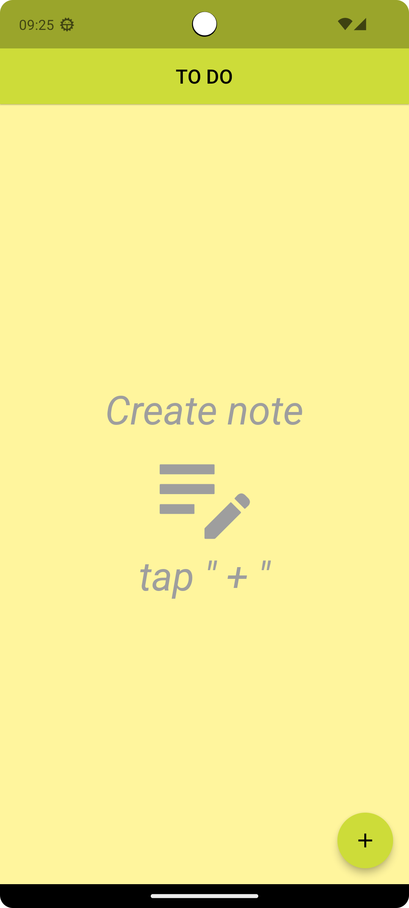
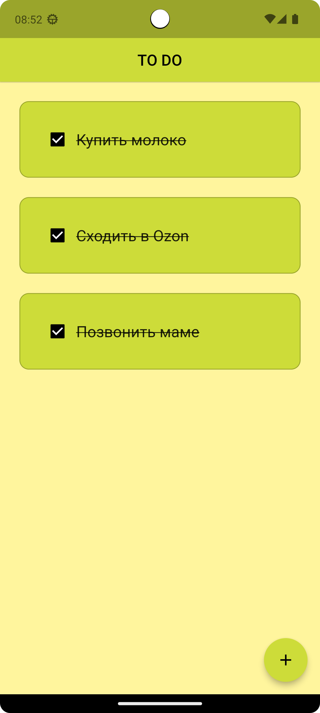
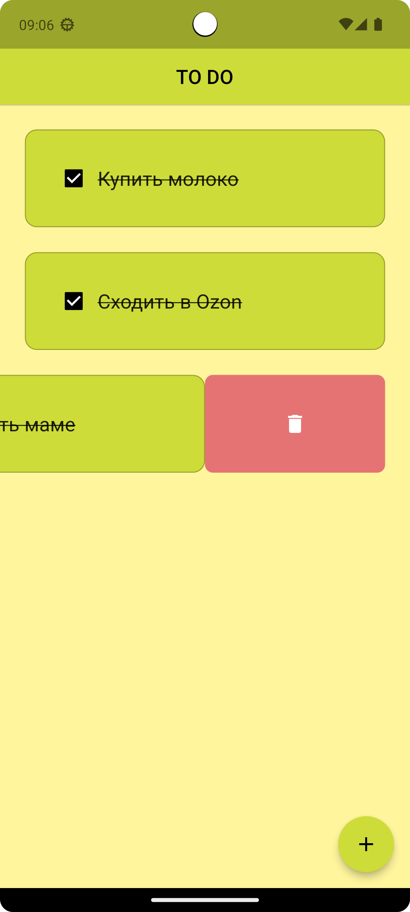

# todo_with_hive

# Описание проекта

**Обучающий проект записной книжки с использованием хранилища Hive, создавался для практики и подробного знакомства с этой библиотекой. Фрэймворк Flutter.**

|            Стартовый экран             |            Создание записи            |             Список задач             | 
|:--------------------------------------:|:-------------------------------------:|:------------------------------------:|
|  |  |  | 

|          Выполненые задачи           |            Удаление задачи            |     |
|:------------------------------------:|:-------------------------------------:|:---:|
|  |  |     |
